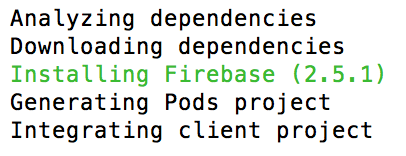
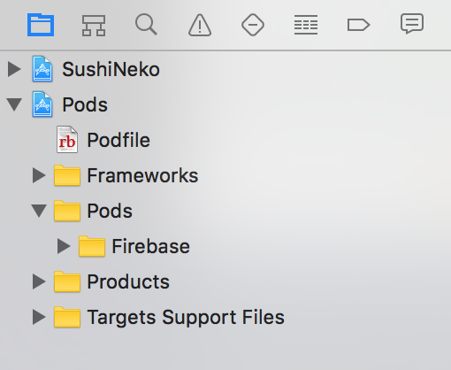
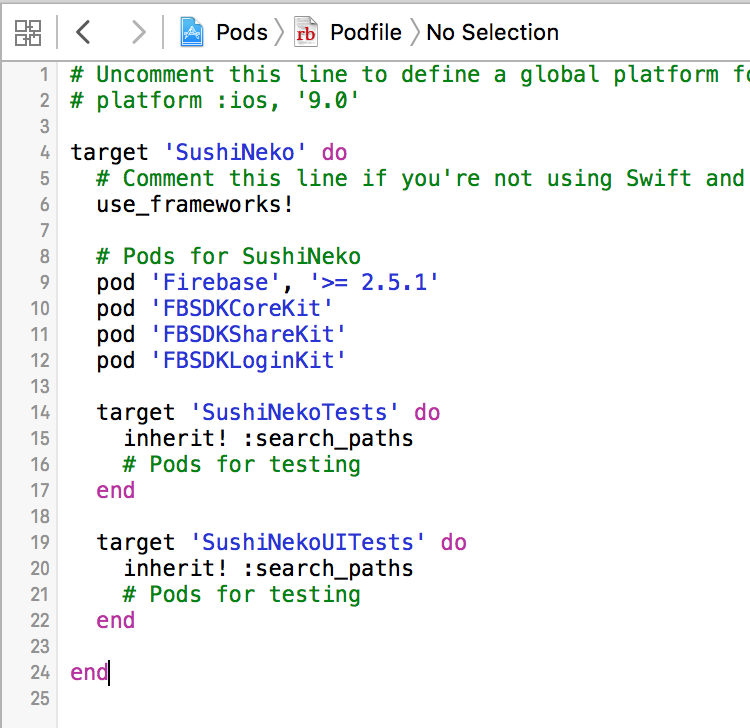
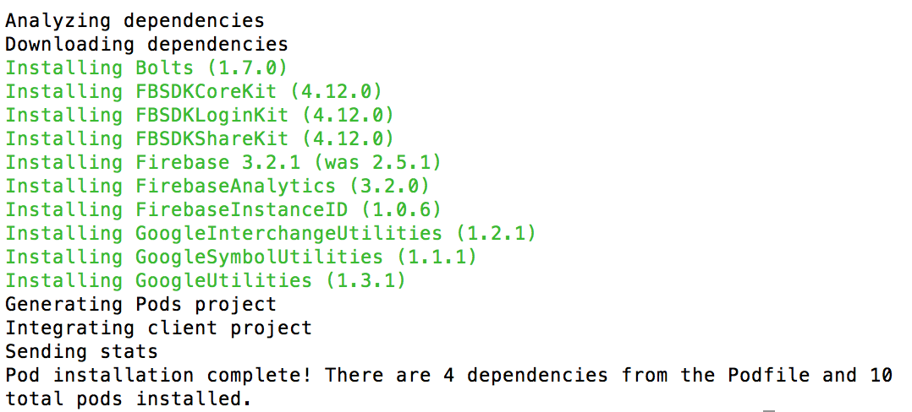

#CocoaPods

So what is CocoaPods? CocoaPods manages library dependencies for your Xcode projects.
For example, you want to add some fantastic new functionality to your project and you've just found a site that provides an iOS library that would be perfect.  The site gives you one option to download a zip file and go through various steps manually to get it working in your project.  

What if this new library requires additional support libraries to work? Then it's up to you to source and install them correctly. What if it requires a specific version of a given library? Welcome to dependency hell...

CocoaPods to the rescue! CocoaPods allow you to specify a text file of desired libraries and CocoaPods will automagically take care of the rest. Ensuring all libraries and dependencies are correctly linked together in your Xcode project.

#Installing CocoaPods

On OS X Yosemite and Mavericks, Ruby 2.0 is included. To install CocoaPods.

> [action]
> Open terminal and run the following command:
>
```
sudo gem install cocoapods
```
>

If you have any issues, take a look first at [CocoaPods Troubleshooting](https://guides.cocoapods.org/using/troubleshooting#installing-cocoapods). If you still have a problem, please ask :]

#CocoaPods setup

Next you are going to initialize CocoaPods for your project.

> [action]
> Open terminal and run the following commands:
>
```
cd your-project-directory
pod init
open -a Xcode Podfile # opens your Podfile in XCode
```
>

##Adding the Firebase library pod

You will need to add the 'Firebase' requirement to the podfile.

> [action]
> Ensure *Podfile* reads as follows:
>
```
# Uncomment this line to define a global platform for your project
# platform :ios, '9.0'
>
target 'SushiNeko' do
  # Comment this line if you're not using Swift and don't want to use dynamic frameworks
  use_frameworks!
>
  # Pods for SushiNeko
  pod 'Firebase', '>= 2.5.1'
>
  target 'SushiNekoTests' do
    inherit! :search_paths
    # Pods for testing
  end
>
  target 'SushiNekoUITests' do
    inherit! :search_paths
    # Pods for testing
  end
>
end
```
> `Save` the file.

##Installing the Firebase pod

You now need to install this **Pod**

> [action]
> In terminal, ensure you are in your project directory and run the following command:
>
```
pod install
```
> **Note: It can take a long time for this action to complete if this is your first time using CocoaPods.  You may want to go grab a drink**

You should hopefully see the following terminal output:

> 

Hurrah, you've setup CocoaPods and installed your first Pod!

#Xcode workspace

Open *SushiNeko.xcworkspace*, from now on please open the project this way.  You will notice there are two projects showing in the navigator, *SushiNeko* and the new *Pods* project.



> Open *GameScene.swift* add the following after `import SpriteKit`
>
```
import Firebase
import FirebaseDatabase
```
> Before continuing it's always sensible to check everything is working so far, build your project and ensure there are no errors.

#Installing the Facebook library pods

> Open the *Podfile* in the *Pods* project.
> Add the following after the **Firebase** pod.
>
```
pod 'FBSDKCoreKit'
pod 'FBSDKShareKit'
pod 'FBSDKLoginKit'
```
> 

Next update your CocoaPods

> [action]
> Open terminal and run the following commands:
>
```
cd your-project-directory
pod update
```
> 

<!-- -->

> Open *GameScene.swift* add the following after `import Firebase`
>
```
import FBSDKCoreKit
import FBSDKShareKit
import FBSDKLoginKit
```
> As before, build your project and ensure no errors so far.

#Summary

Great, you've setup and used CocoaPods to quickly and easily manage 3rd party libraries to your project.
In the next chapter you will be setting up your Firebase account and creating a Facebook iOS App.
