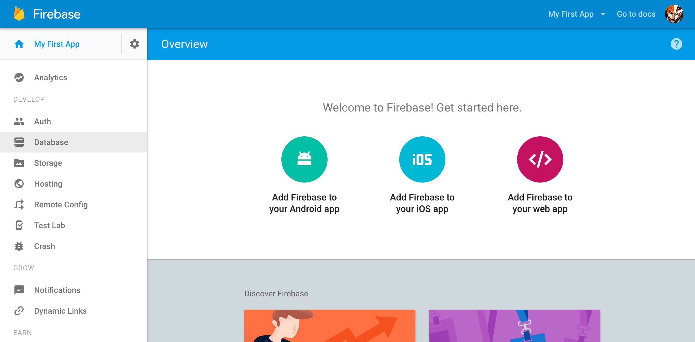
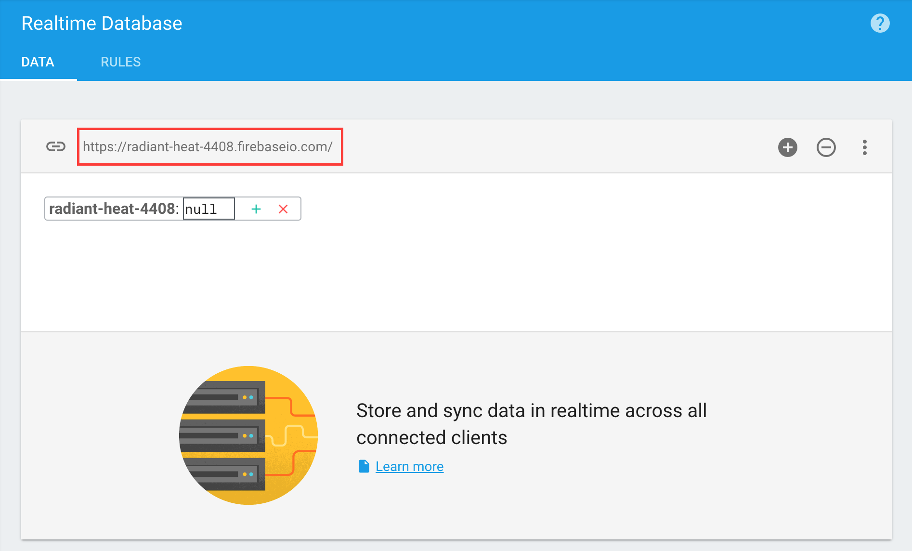
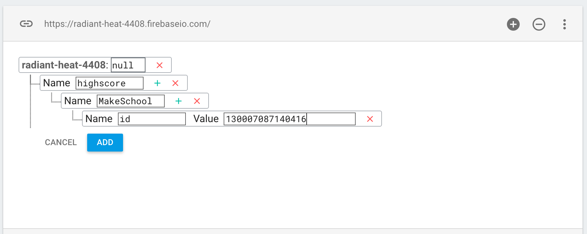
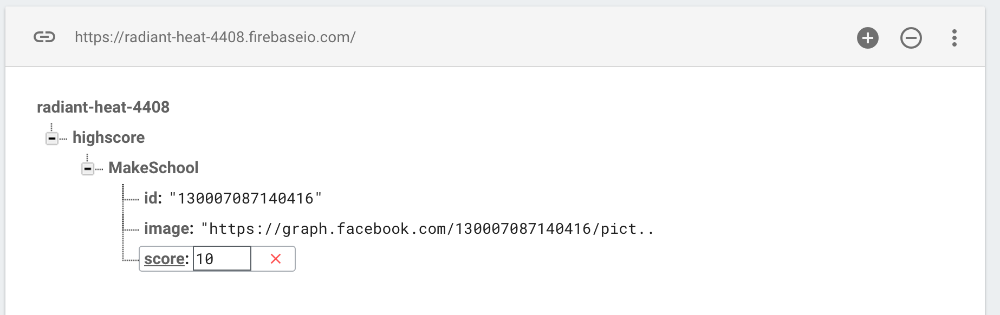

So what is [Firebase](https://firebase.google.com/)? Firebase is a cloud services provider offering numerous services.
You will be using the **Firebase Database** to manage player information.

First step is to navigate to [Firebase](https://firebase.google.com/) and click **SIGN IN**, this will give you the option to create a new account.  Follow this process.

#First project

Once your account is set up, navigate to the [console](https://console.firebase.google.com/)

If you haven't been prompted to create a *New Project* already, please do so now. You can name it whatever you like, I named it *Sushi*.

Click on your project and you should see a screen similar to this:

Next click on *Database* under the develop section, you will be presented with the database editor tool.  This is a great tool for debugging and creating test data for your application.

.  

##Project settings

Great, there is one last step.  You need to download a `GoogleService-Info.plist` from Firebase and add this to your project.

> [action]
> Navigate to [Firebase Project Settings](https://console.firebase.google.com/project/radiant-heat-4408/settings/general/) and run through the *iOS* app process.

All done :]

#Profile design

Let's consider a player's profile for a high score table, what would the data requirements be? You should start off by considering the bare minimum and expand as necessary.

> [action]
> What fields would you start with?

<!-- -->

> [solution]
> - Name
> - Profile image
> - High score

Great, that's certainly a good starting point.  You will be adding connectivity to Facebook in this project so some kind of reference to the player's Facebook account would certainly be an additional data requirement. Let's add a place holder for this in the proposed player profile data structure.

- Facebook account id

##Test data

Now you have an idea of the data you wish to store, let's take a look at manually creating valid test data.

The database editor makes creating test data straightforward.

To translate the proposed data structure into practice, there needs to be a *highscore* node that will hold the *profiles*.  However you can't simply have multiple entries called 'profile' as they have to be unique.  For simplicity you are going to use the player's name.  After that you can add the rest of the data.

> [info]
> One issue I've noticed is you can't create a null entry easily.  There have to be child nodes with data at some point in the hierarchy for it to save a null entry.
>

<!-- -->

> [action]
> Replicate the following data structure:
> 

The id relates to the player's Facebook ID, in the above you're using the ID of [MakeSchool](https://www.facebook.com/makeschool/).  It's more fun to use your own, to grab your Facebook ID you can grab it at [Find my Facebook ID](http://findmyfbid.com/).

> [action]
> Can you add the remaining data fields?
> **Note:** The Facebook ID and image should both be strings so remember those quotes.

<!-- -->

> [solution]
> Your data structure should look very similar to this:
> 

You may have noticed the Facebook URL in **image**, there is a nice way to grab a profile image at the right size for your game.  You can use the URL *https://graph.facebook.com/[YOUR_ID]/picture?type=small*

Great, you now have real data to test with.  In Sushi Neko you will be reading and writing data, I find it easier to tackle *read* operations first with test data.  That way you know exactly what you need to *write*.

#Summary

Great, you've learnt to:

- Create a new Firebase account
- Capture database requirements
- Design database structure
- Add test data

In the next chapter you will be setting up a Facebook account to enable the social authentication element.
