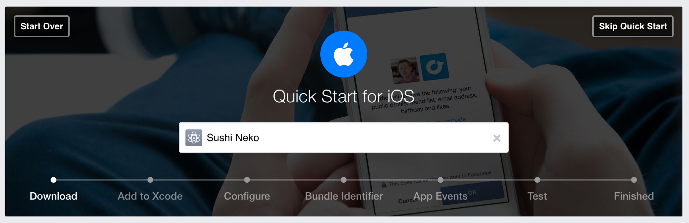

#Facebook authentication

You will be using Facebook to provide player social authentication, this in turns grants you access to the user information you want such as the user's profile image and name.

Thankfully Facebook has a well documented process to take you through this.

> [action]
> Navigate to the [Facebook Developers Site](https://developers.facebook.com/apps/)
>
> Click on *+ Add a New App* and follow the process to setup a **Sushi Neko** iOS App.
>
> Upon completion of this process you should be presented with this screen:
> 

You'll be pleased to know that you can skip the first two steps, as CocoaPods have kindly taken care of this.

> [action]
> See if you can follow the rest of this process.
> **Hint:** You will need all of the entries in *Configure*

You should finally reach the section that asks you to add code!

##Integration code

Finally time to add some code to your project! Wait.... The sample code given is Objective-C, we'll give you a hand with this part.

> [action]
> Open *AppDelegate.swift* and add the following library import:
>
```
import FBSDKCoreKit
```
>
> Next add the following method to the *AppDelegate* class.
>
```
func application(application: UIApplication, openURL url: NSURL,
                 sourceApplication: String?, annotation: AnyObject) -> Bool {
    return FBSDKApplicationDelegate.sharedInstance()
        .application(application, openURL: url,
                     sourceApplication: sourceApplication, annotation: annotation)
}
```
>
> Next replace `return true` in the `application(...)` method with:
>
```
return FBSDKApplicationDelegate.sharedInstance()
            .application(application, didFinishLaunchingWithOptions: launchOptions)
```
>
> Next add the following to the `applicationDidBecomeActive(...)` method:
>
```
FBSDKAppEvents.activateApp()
```
>
>

Excellent, code converted and added.

#Summary

That's the setup stage of this tutorial complete.

You've learnt to:

- Setup a new Facebook App
- Integrate Objective-C Facebook code into Swift

Finally, it's time to get started on the game code!
