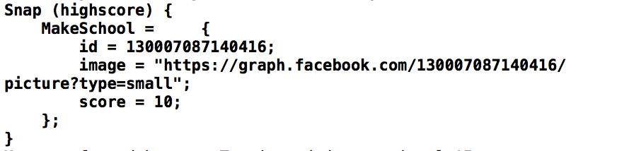

Finally, time to start coding!
You will start by connecting to the Firebase database and retrieving the test data you created earlier.

##Firebase database

First you need to create a reference to your Firebase database.

> [action]
> Add this property to your *GameScene* class.
>
```
/* Firebase connection */
    var firebaseRef = FIRDatabase.database().referenceWithPath("/highscore")  
```
>

In your case you want to have the root of your reference to be in the *HighScore* table.

#Reading data

Firebase offers different ways to retrieve information, you can subscribe to events and Firebase will notify your app in realtime of any changes.  This is a powerful feature for example in a chat based application. I would recommend you have a look at the [Data Retrieval](https://firebase.google.com/docs/database/ios/retrieve-data) documentation.

In this tutorial you don't really need to be notified the instant someone gets a high score.  You will be instead using a query to read-once and pull back the top 5 high scores.

> [action]
> Add this code to the end of the `didMoveToView(...)` method:
>
```
firebaseRef.queryOrderedByChild("score").queryLimitedToLast(5).observeEventType(.Value, withBlock: { snapshot in
>
    /* Check snapshot has results */
    if snapshot.exists() {
>        
        /* Loop through data entries */
        for child in snapshot.children {
            print(child)
        }
    }
>    
}) { (error) in
    print(error.localizedDescription)
}
```
>

Run your game...

You should hopefully be presented with your Firebase test data. Please ignore any other Firebase warnings for now :]



#Player profile

Do you remember the player profile structure you designed in the Firebase chapter?
Now that you can retrieve data from Firebase, you will want to store it.  

> [action]
> Can you create an appropriate data structure to hold this information?

<!-- -->

> [solution]
> Add the following code globally to *GameScene.swift*
>
```
/* Social profile structure */
struct Profile {
    var name = ""
    var imgURL = ""
    var facebookId = ""
    var score = 0
}
```

Great, now you have a struct to store the Firebase data.

##Populating profile struct

> [action]
> Replace your `firebaseRef.queryOrderedByChild(...)` method with the following:
>
```
firebaseRef.queryOrderedByChild("score").queryLimitedToLast(5).observeEventType(.Value, withBlock: { snapshot in
>    
    /* Check snapshot has results */
    if snapshot.exists() {
>        
        /* Loop through data entries */
        for child in snapshot.children {
>            
            /* Create new player profile */
            var profile = Profile()
>            
            /* Assign player name */
            profile.name = child.key
>            
            /* Assign profile data */
            profile.imgURL = child.value.objectForKey("image") as! String
            profile.facebookId = child.value.objectForKey("id") as! String
            profile.score = child.value.objectForKey("score") as! Int
>            
            print(profile)
        }
    }
>    
}) { (error) in
    print(error.localizedDescription)
}
```
>

Run your game...
Check the debug, you should hopefully see the `Profile` printed out as expected.

#Summary

Great job, you can now retrieve data from Firebase and store it in a custom struct.

Next you will utilize the profile struct data and dynamically add player profiles to the sushi tower!
