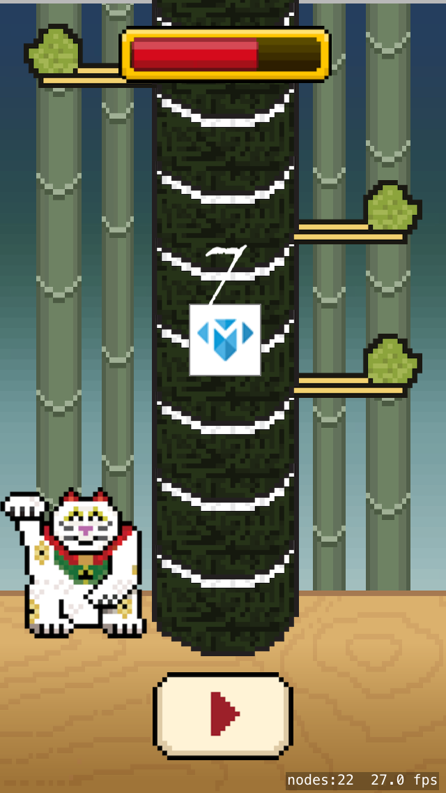

You are going to create a highscore tower, this will be another array that will store the player profiles based upon score.  The score will relate directly to the position in the sushi tower as each piece of sushi is worth one point.

The final result should look a lot like this, showing the Make School player at position 10 of the stack.



#Adding the high score tower

You need to store player profiles and access them using an index that matches their score.  

> [action]
> Can you add an appropriate storage type to the *GameScene* class to hold this data?

<!-- -->

> [solution]
> Add this custom dictionary to the *GameScene* class.
>
```
/* High score custom dictionary */
var scoreTower: [Int:Profile] = [:]
```
>

Now you have a suitable storage property, you need to add each profile to the dictionary.

> [action]
> Can you add profiles retrieved from the Firebase database query to the *scoreTower*?

<!-- -->

> [solution]
> Add the following code after all profile data has been assigned.
>
```
/* Add new high score profile to score tower using score as index */
self.scoreTower[profile.score] = profile
```
>

#Order of operation

Great, so you can download player data, store it in the score tower and you're ready to learn how to display them in the game.  However, once you add networking to a game, you need to consider the order of operations in your game.

Firebase operations happen asynchronously using a background queue, simply put they do not block the game from running while any Firebase actions such as returning database results are running.  If the operation happened synchronously, the game would appear to freeze while the player profile download took place.  For something like a small piece of profile data it may not be noticeable.  However, once you move onto larger data like images this lag can lead to terrible user experience.

So we know Firebase runs asynchronously, that's great. However, that now presents you with another issue to solve.  You want to ensure you have this data before the game starts.  As it stands the sushi is already stacked before you even start the Firebase connection.

What do you think the order of operations should be?

1. Connect to Firebase
2. Start game

That's certainly the correct order, yet the game will start almost instantly after the Firebase connection as this database access takes place asynchronously on a background queue.  There is no delay, the game simply starts without any data.

> [action]
> What do you think the solution would be?

#State management

Do you remember the game state management from the previous Sushi Neko tutorial?  

```
/* Tracking enum for game state */
enum GameState {
    case Title, Ready, Playing, GameOver
}
```

It would be nice to hook into this and add a new *GameState*, some sort of pre-title state for loading data.  How about `Loading` :]

##The loading state

> [action]
> Add an additional `Loading` state to the beginning of the *GameState* enum.

Now you have a new state, let's put it into action.

> [action]
> Change the default `state` to `.Loading`

You want to break out the initial `addPiece` method calls into a new function so this action can be called after `.Loading`.

> [action]
> Add the following method to the *GameScene* class
>
```
func stackSushi() {
    /* Seed the sushi tower */
>
    /* Manually stack the start of the tower */
    addTowerPiece(.None)
    addTowerPiece(.Right)
>
    /* Randomize tower to just outside of the screen */
    addRandomPieces(10)
}
```
> Remove those method calls from `didMoveToView(...)`

Run the game...
Oh no it's broken...

You have the high score tower data but no sushi tower.  You need to call `stackSushi` to generate the tower, it would be good to call it after populating the high score tower.

> [action]
> Update the `state` property as shown:
>
```
/* Game management */
var state: GameState = .Loading {
    didSet {
        if state == .Title {
            stackSushi()
        }
    }
}
```
>

<!-- -->

> [action]
> Change the game state to `.Title` after the profile data has been loaded.

<!-- -->

Your code should look as follows for the Firebase call:

```
firebaseRef.queryOrderedByChild("score").queryLimitedToLast(5).observeEventType(.Value, withBlock: { snapshot in

        /* Check snapshot has results */
        if snapshot.exists() {

            /* Loop through data entries */
            for child in snapshot.children {

                /* Create new player profile */
                var profile = Profile()

                /* Assign player name */
                profile.name = child.key

                /* Assign profile data */
                profile.imgURL = child.value.objectForKey("image") as! String
                profile.facebookId = child.value.objectForKey("id") as! String
                profile.score = child.value.objectForKey("score") as! Int

                /* Add new high score profile to score tower using score as index */
                self.scoreTower[self.score] = profile
            }
        }

        self.state = .Title

    }) { (error) in
        print(error.localizedDescription)
    }
}
```

#Drawing the tower

To display the high score tower you are going to dynamically download player profile images and use them to create a new *SKSpriteNode* and add it on top of the sushi piece at the same position as the profile's high score.  So with our test data with score `10`, you want to ensure this gets added to sushi piece `10`.

First of all you will need a sushi piece tracker.

> [action]
> Add this property to the *GameScene* class:
>
```
/* Sushi piece creation counter */
var sushiCounter = 0
```
> Next, add the track to the end of `addTowerPiece(...)`
>
```
/* Sushi tracker */
sushiCounter += 1
```

With that in place, let's look at how to create an *SKSpriteNode* from a web image.

##Creating a Sprite from a URL

There is no direct method to create an *SKSpriteNode* from a URL. You have to jump through a few hoops first.

1. Create an *NSURL* by supplying the *Profile.imgURL*
1. Create an *NSData* by supply an *NSURL*
1. Create a *UIImage* by supplying an *NSData*
1. Create an *SKTexture* by supplying a *UIImage*
1. Create an *SKSpriteNode* by supplying an *SKTexture*

> [action]
> How many of these steps can you attempt yourself ?

<!-- -->

> [solution]
> This process would look like:
>
```
let imgURL = NSURL(string: profile.imgURL)
let imgData = NSData(contentsOfURL: imgURL)
let img = UIImage(data: imgData)
let imgTex = SKTexture(image: img)
let imgNode = SKSpriteNode(texture: imgTex, size: CGSize(width: 50, height: 50))
```
>

When dealing with data that could possibly be invalid, it's good to use the `guard` statement to protect your process from any possible bad data issues. For example when grabbing the `profile.imgURL` you want to ensure this was valid before moving on to the more expensive operations in the process. If it's invalid you want to skip it and move on to the next entry.

> [action]
> Add the following code to the end of `addTowerPiece(...)`:
>
```
/* Do we have a social score to add to the current sushi piece? */
guard let profile = scoreTower[sushiCounter] else { return }
>
/* Grab profile image */
guard let imgURL = NSURL(string: profile.imgURL) else { return }
>
/* Perform image download task */
guard let imgData = NSData(contentsOfURL: imgURL) else { return }
guard let img = UIImage(data: imgData) else { return }
>
/* Create texture from image */
let imgTex = SKTexture(image: img)
>
/* Create a new sprite using profile texture, cap size */
let imgNode = SKSpriteNode(texture: imgTex, size: CGSize(width: 50, height: 50))
>
/* Add profile sprite as child of sushi piece */
newPiece.addChild(imgNode)
imgNode.zPosition = newPiece.zPosition + 1
>
```

##Adding a border

> [action]
> Can you add a border to the profile image?

<!-- -->

> [solution]
> Add a colored sprite and place the profile sprite on top.
>
```
/* Create background border */
let imgNodeBg = SKSpriteNode(color: UIColor.grayColor(), size: CGSize(width: 52, height: 52))
>
/* Add as child of sushi piece */
newPiece.addChild(imgNodeBg)
imgNodeBg.zPosition = newPiece.zPosition + 1
>
/* Create a new sprite using profile texture, cap size */
let imgNode = SKSpriteNode(texture: imgTex, size: CGSize(width: 50, height: 50))
>
/* Add profile sprite as child of sushi piece */
imgNodeBg.addChild(imgNode)
imgNode.zPosition = imgNodeBg.zPosition + 1
```
>

Run the game, it should now look like this:


#Synchronous

The code you just wrote is running synchronously, right now it's just 1 profile image.  What if you had the maximum 5 results? Even on good WiFi this will produce a noticeable delay, the player will tap the screen and nothing will happen.  What if they have limited mobile data speed, that 1-2s delay on WiFi could increase to 10s or more.

You will make use of *dispatch_async*, this lets you run a block of code to execute on another queue.
Time for you to wrap up this process.

> [action]
> Replace the previous section code with:
>
```
/* Do we have a social score to add to the current sushi piece? */
guard let profile = scoreTower[sushiCounter] else { return }
>
/* Grab profile image */
guard let imgURL = NSURL(string: profile.imgURL) else { return }
>
/* Perform code block asynchronously in background queue */
dispatch_async(dispatch_get_global_queue(DISPATCH_QUEUE_PRIORITY_DEFAULT, 0)) {
>    
    /* Perform image download task */
    guard let imgData = NSData(contentsOfURL: imgURL) else { return }
    guard let img = UIImage(data: imgData) else { return }
>    
    /* Create texture from image */
    let imgTex = SKTexture(image: img)
>    
    /* Create background border */
    let imgNodeBg = SKSpriteNode(color: UIColor.grayColor(), size: CGSize(width: 52, height: 52))
>    
    /* Add as child of sushi piece */
    newPiece.addChild(imgNodeBg)
    imgNodeBg.zPosition = newPiece.zPosition + 1
>    
    /* Create a new sprite using profile texture, cap size */
    let imgNode = SKSpriteNode(texture: imgTex, size: CGSize(width: 50, height: 50))
>    
    /* Add profile sprite as child of sushi piece */
    imgNodeBg.addChild(imgNode)
    imgNode.zPosition = imgNodeBg.zPosition + 1
}
```

You will have noticed that the first two actions are outside of the `dispatch_async`, these are quick
sanity checks that can be performed before beginning the more expensive `dispatch_async` operation.

Run the game.
Oh no it crashes! But why?

There is a problem here, you've correctly moved this code to be performed in a background queue.  The image is downloaded with no problems.  However, there is a problem, your game is taking place in the `main_queue`. So you need to ensure you that sprite creation code is called in the `main_queue`.

> [action]
> Replace the previous code block as shown:
>
```
/* Do we have a social score to add to the current sushi piece? */
guard let profile = scoreTower[sushiCounter] else { return }
>
/* Grab profile image */
guard let imgURL = NSURL(string: profile.imgURL) else { return }
>
/* Perform code block asynchronously in background queue */
dispatch_async(dispatch_get_global_queue(DISPATCH_QUEUE_PRIORITY_DEFAULT, 0)) {
>    
    /* Perform image download task */
    guard let imgData = NSData(contentsOfURL: imgURL) else { return }
    guard let img = UIImage(data: imgData) else { return }
>    
    /* Perform code block asynchronously in main queue */
    dispatch_async(dispatch_get_main_queue(), {
>        
        /* Create texture from image */
        let imgTex = SKTexture(image: img)
>        
        /* Create background border */
        let imgNodeBg = SKSpriteNode(color: UIColor.grayColor(), size: CGSize(width: 52, height: 52))
>        
        /* Add as child of sushi piece */
        newPiece.addChild(imgNodeBg)
        imgNodeBg.zPosition = newPiece.zPosition + 1
>        
        /* Create a new sprite using profile texture, cap size */
        let imgNode = SKSpriteNode(texture: imgTex, size: CGSize(width: 50, height: 50))
>        
        /* Add profile sprite as child of sushi piece */
        imgNodeBg.addChild(imgNode)
        imgNode.zPosition = imgNodeBg.zPosition + 1
    });
}
```
>

Run the game, the crash should be gone and you've now implemented asynchronous execution.

#Summary

Great progress, you now have players displayed on the tower.

You've learnt to:

- Expand game state management
- Use Firebase to retrieve player data
- Populate the high score tower
- Download remote images
- Turn remote images into Sprite Nodes
- Perform asynchronous operations

In the next chapter, you will be implementing Facebook Authentication and retrieving user information.
