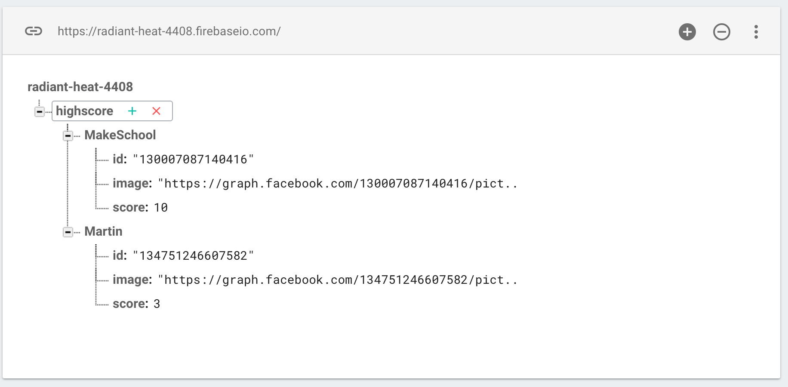

Now we know about other players, as this information is retrieved from the Firebase database.  However, what about our user profile? We need to authenticate with Facebook and store that information to create our own player profile.  Later on you will then save this information to Firebase along with your high score.

> [info]
> *From this point on you are required to test on device*

##Authentication

The first step is authentication with Facebook using the Facebook SDK, this code is well documented at [Facebook Docs](https://developers.facebook.com/docs/)

1. Check if we already have a stored access token
2. If not then request a login and ask for permission for the user's profile, email and friends list.

> [action]
> Add the following code before the Firebase query in `didMove(...)`
>
```
/* Facebook authentication check */
if (FBSDKAccessToken.current() == nil) {
>            
    /* No access token, begin FB authentication process */
    FBSDKLoginManager().logIn(withReadPermissions: ["public_profile","email","user_friends"], from:self.view?.window?.rootViewController, handler: {
        (facebookResult, facebookError) -> Void in
>                
        if facebookError != nil {
            print("Facebook login failed. Error \(facebookError)")
        } else if facebookResult!.isCancelled {
            print("Facebook login was cancelled.")
        } else {
            let accessToken = FBSDKAccessToken.current().tokenString
>                    
            print(accessToken)
        }
    })
}
```
>

If you authenticated you should see the *accessToken* value displayed in the console.

#Facebook user profile

Once authenticated you can retrieve the user's information.  You want their Facebook ID, first name and profile URL.
Before you retrieve this data you need somewhere to store it.

> [action]
> Add the following property to the *GameScene* class:
>
```
var playerProfile = Profile()
```
>

Next you will add code to look up the user's profile and then store this information.

> [action]
> Add the following code after the authentication code:
>
```
/* Facebook profile lookup */
if (FBSDKAccessToken.current() != nil) {
>            
    FBSDKGraphRequest(graphPath: "me", parameters: ["fields": "id, first_name"]).start(completionHandler: { (connection, result, error) -> Void in
        if (error == nil){
>                
            if let result = result as? NSDictionary {
                /* Update player profile */
                self.playerProfile.facebookId = result.value(forKey: "id") as! String
                self.playerProfile.name = result.value(forKey: "first_name") as! String
                self.playerProfile.imgURL = "https://graph.facebook.com/\(self.playerProfile.facebookId)/picture?type=small"
                print(self.playerProfile)
            }
        }
    })
}
```
>

It's always good to add `print` statements to sanity check your results, especially the first few times. Until you feel comfortable that everything is working as expected.

So finally the game now knows who you are!

#Saving player data

Now you are ready to save your own profile to the Firebase database!
You don't want to save it every time the game ends, only when you've reached a new high score.  You should also only save data if this profile has a Facebook id.

> [action]
> Add the following code in the `gameOver` method, after `character.run(...)`:
>
```
/* Check for new high score and has a facebook user id */
if score > playerProfile.score && !playerProfile.facebookId.isEmpty {
>            
    /* Update profile score */
    playerProfile.score = score
>            
    /* Build data structure to be saved to firebase */
    let saveProfile = [playerProfile.name :
        ["image" : playerProfile.imgURL,
            "score" : playerProfile.score,
            "id" : playerProfile.facebookId ]]
>            
    /* Save to Firebase */      
    firebaseRef.updateChildValues(saveProfile, withCompletionBlock: {
        (error:Error?, ref:FIRDatabaseReference!) in
        if (error != nil) {
            print("Data save failed: ", error)
        } else {
            print("Data saved success")
        }
    })
}
```
>

Run the game... You should achieve a high score as your default score is `0`.
You should have gotten a notification in the console of `Data saved success`.

The moment of truth, navigate to your Firebase database view and you will hopefully see something like this.



#Summary

Congratulations you've completed *Sushi Neko Networking*, give the person next to you a high five or a high ten if you managed it without peaking at the solutions.

You learnt to:
- Authenticate with Facebook
- Ask for access permissions
- Retrieve user profile data
- Store profile data
- Save profile data to Firebase

The next chapter will be a recap of everything you have covered so far, well done.
