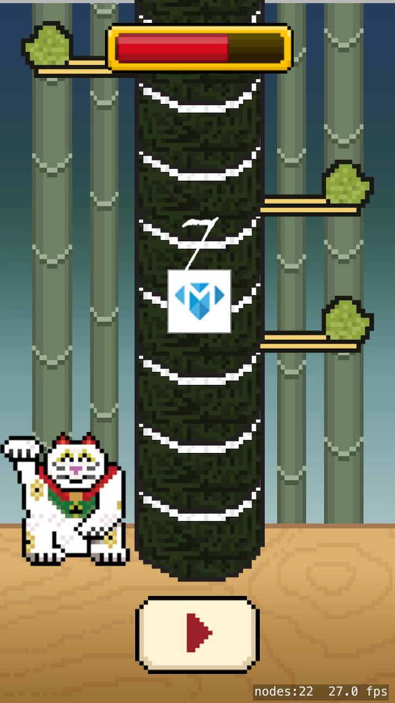

Congrats again on finishing *Sushi Neko Networking* and expanding a great iPhone game!

Let's take a look at what you have learned.

##CocoaPods

- Using the CocoaPods dependency manager to add popular 3rd party libraries to your project.

##Firebase

- Setting up a new Firebase account
- Capturing data requirements
- Designing database structure
- Manually adding test data through the Firebase database interface
- Reading player data
- Storing player data

##Facebook

- Setting up a new Facebook App
- Integrating Objective-C Facebook code into Swift
- Implementing authentication
- Requesting permission for user information
- Retrieving user information and storing in local profile

##High score Tower

- Creating a custom dictionary
- Downloading remote images
- Creating a Sprite Node from a downloaded image
- Implementing asynchronous code execution using queues

#Solution

[Download Sushi Neko](https://github.com/MakeSchool-Tutorials/Sushi-Neko-Networking-SpriteKit-Swift-Solution).

#Bonus stage

If you've made it this far you're ready to face the **bonus stage**, although this content is optional.  I would highly recommend it as it will generate ideas for your own game ideas and give you some essential practical experience.  The challenges are designed to help you round off your game.
